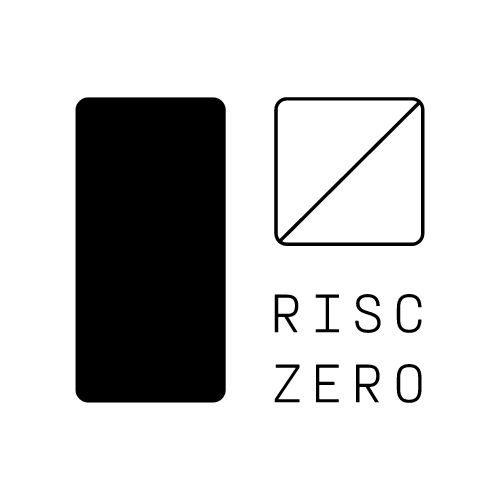

# Security Auditing Summary: zero-knowledge Virtual Machine (zkVM)
This document provides a high-level summary of external security auditing and assessment of the RISC Zero zero-knowledge Virtual Machine (zkVM) protocol and implementation.

## Product Overview:
The RISC Zero [zero-knowledge virtual machine (zkVM)](https://dev.risczero.com/api/next/zkvm/) lets you prove correct execution of arbitrary Rust code. By allowing users to build zero-knowledge applications that leverage existing Rust packages, the RISC Zero zkVM makes it quick and easy to build powerful verifiable software applications. 

## Audit Log

| Start | Completed | Audit Firm | Audit Report |
|-------|-----------|------------|---------------|
| 2023-08-22 | 2023-10-26 | [Hexens](#about-hexens) | [Hexens zkVM 0.17.0 Security Audit](zkVM/hexens_zkVM_20231031.pdf) |
| 2023-11 | 2024-01 | [Hexens](#about-hexens) | [Circuit Audit](circuits/hexens_v1c_stark2snark_20240520.pdf)|
| 2024-02 | 2024-03 | [Hexens](#about-hexens) | [Stark2Snark Circuit](circuits/hexens_v1c_stark2snark_20240520.pdf)|
| 2024-05 | 2024-06 | [Hexens](#about-hexens) | [SNARK Verifier Contract](contracts/hexens_verifiercontract_20240605.pdf) |

## Appendix A: Audit Summary

### Hexens zkVM 0.17.0 Security Audit

This was an end-to-end deep dive assessment of the zkVM platform in support of our 1.0 target security objectives.  Hexens leveraged A/B testing from two teams, with detailed involvement from Hexens officers, in particular Vahe Karapetyan. 

#### Scoping Notes:
The EDSL version of the circuit was not included in the assessment scope, however, source code was provided for context as needed.

An expansion of scope was amended to include key aspects of recursion which were released in zkVM 0.19.

| Details | |
|---------|-|
| Date Completed: | 2023-10-26 |
| Version: | [zkVM 0.17.0](https://github.com/risc0/risc0/tree/323b5f58e45a7b0de02df6227e1e9de475f70176)
| Duration: | 300 person days |
| Source code provided: | Yes |

#### Findings
| Severity | Short Description | Status | Audit Verification of Status |  
|----------|-------------------|--------|-------|
| high | DoS with SHA ecall using big block compression count | fixed | verified |
| medium | ELF segment virtual address can be set to an arbitrary address | fixed | verified |
| medium| ecall paramaters missing address range checks| fixed | verified |
| low | CUDA memory leak can leak private inputs from data trace | n/a [1]| n/a |
| low | executor ELF loader virtual address word alignment check missing | fixed | verified |
| low | non constant-time implementation in finite field operations | n/a [2] | n/a |
| low | syscall pointer type parameters missing address range check | fixed | verified |

1. This is an upstream issue in older versions of the NVidia CUDA binary, RISC Zero will encourage the use of later versions of CUDA as implementation changes here to workaround this bug by the zkVM are complex.
2. Constant time within the zkVM guest execution incurs unnecessary performance impacts, as in almost all reasonable use cases an evil host can already snoop on guest private inputs.

### Hexens v1 Circuit Audit
This was a security review of RISC Zero's v1 zk circuit. This was executed by Hexens zk circuit specialists over 10 engineering weeks.

### Hexens Stark2Snark Audit
This was a security review of RISC Zero's Stark-to-Snark circuit relevant to the on-chain verification of RISC Zero receipts.

## Appendix: B Audit Firm Details

### About Hexens
[Hexens](https://hexens.io) is a cybersecurity company that strives to elevate the standards of security in Web 3.0, create a safer environment for users, and ensure mass Web 3.0 adoption.

Hexens has multiple top-notch auditing teams specialized in different fields of information security, showing extreme performance in the most challenging and technically complex tasks, including but not limited to: Infrastructure Audits, Zero Knowledge Proofs / Novel Cryptography, DeFi and NFTs. Hexens not only uses widely known methodologies and flows, but focuses on discovering and introducing new ones on a day-to-day basis.*

Audit points of contact: 
* Vahe Karapetyan <v.k@hexens.io> 
* Konstantin Andriotis <k.a@hexens.io>
